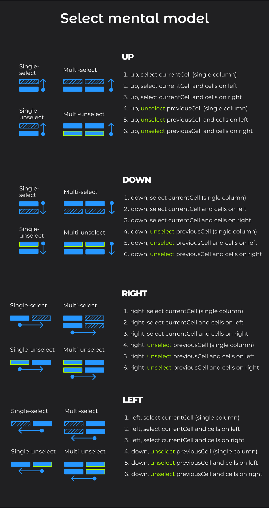

# Spreadsheet app written in TypeScript

1. Run the web service: To run [`ts-spreadsheet` app](https://github.com/NadiaIdris/ts-spreadsheet) locally, first clone the [`ts-spreadsheet-api` repo](https://github.com/NadiaIdris/ts-spreadsheet-api) and run it by calling `npm run start`.
2. Then clone this repo and run it by calling `npm run start`.
3. Open `http://localhost:3000` in your browser.

## Features

- [x] Flexible grid cells
    <video width="640" height="360" controls>
  <source src="docs/media/responsive-design.mp4" type="video/mp4">
</video>

- [x] Change spreadsheet name.
    <video width="640" height="360" controls>
  <source src="docs/media/rename-spreadsheet.mp4" type="video/mp4">
</video>

- [x] Copy/paste/cut one cell using keyboard or context menu
    <video width="640" height="360" controls>
  <source src="docs/media/copy-paste-cut.mp4" type="video/mp4">
</video>

## Features using mouse

- [x] Single select cell and multi-select cells
    <video width="640" height="360" controls>
  <source src="docs/media/single-and-multi-cell-select.mp4" type="video/mp4">
</video>

- [x] Add/delete one column
    <video width="640" height="360" controls>
  <source src="docs/media/add-and-delete-one-column.mp4" type="video/mp4">
</video>

- [x] Add/delete multiple columns
    <video width="640" height="360" controls>
  <source src="docs/media/add-and-delete-multiple-columns.mp4" type="video/mp4">
</video>

- [x] Add/delete one row
    <video width="640" height="360" controls>
  <source src="docs/media/add-delete-one-row.mp4" type="video/mp4">
</video>

- [x] Add/delete multiple rows
    <video width="640" height="360" controls>
  <source src="docs/media/add-delete-multiple-rows.mp4" type="video/mp4">
</video>

- [x] Drag and drop one cell using mouse
    <video width="640" height="360" controls>
  <source src="docs/media/drag-drop-one-cell.mp4" type="video/mp4">
</video>

- [ ] Drag and drop multiple cells using mouse
- [ ] Undo/redo (version history)
- [ ] Resize columns and rows
- [ ] Freeze columns and rows
- [ ] Sort columns
-
- [ ] Add comments to cells. Comments are displayed in a tooltip when hovering over a cell. Add images to comments.
  - [ ] Option to edit comments in a modal dialog
  - [ ] Option to delete comment
  - [ ] Option to mark comment resolved.
  - [ ] Get link to this comment. Copy the link to clipboard.

## Features using keyboard

- [ ] Single select cell and multi-select cells
- [x] Keyboard navigation: move up, down, left, right
    <video width="640" height="360" controls>
  <source src="docs/media/keyboard-navigation.mp4" type="video/mp4">
</video>

- [ ] Drag and drop one or more cells using keyboard
- [ ] Undo/redo (version history)

## Icons

> 💡 React uses [SVGR](https://react-svgr.com/) to convert svg icons to React components.

1. Add svg icons to the `src/assets/icons` folder.

2. Import icons as React components like this

   ```typescript
   import { ReactComponent as IconAdd } from "../../assets/icons/add.svg";
   ```

3. Use icons like this

   ```typescript
   <IconAdd /> // Add any props like color, width, height, etc.
   ```

### Change the color of an icon

> Change the `fill` attribute of the SVG element to `currentColor` like this:

```xml
  <span className="search-icon">
    <svg viewBox="0 0 731 731" fill="none" xmlns="http://www.w3.org/2000/svg">
      <path
        d="M551.28 468C641.348 333.253 609.029 142.973 465.296 48.8133C354.932 -23.4053 207.576 -14.072 107.016 71.3293C-28.3176 186.36 -34.5043 390.409 88.5838 513.609C189.849 614.875 350.384 629.807 468.33 550.943L613.344 708.436C639.36 736.785 683.693 737.837 710.874 710.655C738.057 683.472 737.125 639.019 708.656 613.124L551.162 468.111L551.28 468ZM449.78 449.448C367.878 531.349 234.646 531.349 152.753 449.448C70.8518 367.547 70.8518 234.315 152.753 152.421C193.701 111.473 247.488 91.0573 301.273 91.0573C355.054 91.0573 408.841 111.588 449.793 152.421C531.694 234.323 531.694 367.555 449.793 449.448H449.78Z"
        fill="currentColor"
      />
    </svg>
 </span>
```

> This allows us to style the icon with the `color` CSS property.

```css
.search-icon {
  color: red;
}
```

> Or we can use prop `color` and pass the color to the icon component.

- Usage:

```typescript
<IconAdd color="red" />
```

### Change other props of the svg element (width, height, etc.)

> 💡 Find other props you can add to the svg element: search `interface SVGAttributes<T>` in `node_modules/@types/react/index.d.ts` file.

> Use the `className` prop to pass a class name to the svg element.

```typescript
<IconAdd className="icon" />
```

Then use CSS to style the svg element.

```css
.icon {
  width: 20px;
  height: 20px;
}
```

## Selected and Focused cell

- Selected and focused cell are two different things. They can be the same cell but they don't have to be.
- Selected cell is the cell that is clicked on and there can be multiple selected cells at the same time.
- Focused cell is the cell that is focused (by pressing Tab key or clicking on a cell). There can be only one focused cell. We use focused cell to select multiple cells by pressing Shift key and clicking on another cell.

## Events and the order they get called

- While holding down the mouse on a cell (onMouseDown), then move the cursor over the next cell, onMouseOver gets called on the currently hovered cell. When releasing the mouse button, onMouseUp gets called on the currently hovered cell:

  1. onMouseDown
  2. onMouseOver
  3. onMouseUp

  - Note: onClick event handler will not be called!!

  4.  onDrag, onDragEnd, onDragEnter, onDragExit, onDragLeave, onDragOver, onDragStart, onDrop: These are HTML5 drag and drop events. They are not part of the normal mouse event flow and need to be triggered manually by calling event.dataTransfer.setData() in an onMouseDown or onDragStart event handler.

- When holding down the mouse on a cell (onMouseDown), then releasing the mouse button over the same cell, the following event handlers get called:
  1. onMouseDown
  2. onMouseUp
  3. onClick

## Select/multi-select cells

- First we check direction: if the user selected a cell in the same row as `selectionStartCell.rowIdx` or cell in a row down from `selectionStartCell.rowIdx`. If yes, then in that row add all the columns from `selectionStartCell.columnIdx` to `currentCell.columnIdx` to `selectedCells` array.
- If the user selected a cell in a row above `selectionStartCell.rowIdx`, then loop over all the rows from `selectionStartCell.rowIdx` to `currentCell.rowIdx` and add all the columns from `selectionStartCell.columnIdx` to `currentCell.columnIdx` to `selectedCells` array.

### Selection data structure

```typescript
interface SelectedCell {
  rowIdx: number | null;
  columnIdx: number | null;
}

interface SelectedCells {
  previousCell: SelectedCell;
  selectionStartCell: SelectedCell;
  selectionEndCell: SelectedCell;
  allSelectedCells: SelectedCell[];
}
```

  

## Code style guide

- Truth/falsy and control flow:
  - Arrays: always use `myArray.length > 0` instead of `myArray.length`. This is more explicit and easier to read. Also don't use just `myArray` and expect it to return falsy if the array is empty. This is not true. An empty array is truthy in JavaScript (same as empty object).
    - MDN docs on [truthy](https://developer.mozilla.org/en-US/docs/Glossary/Truthy).
    - MDN docs on [false](https://developer.mozilla.org/en-US/docs/Glossary/Falsy).
